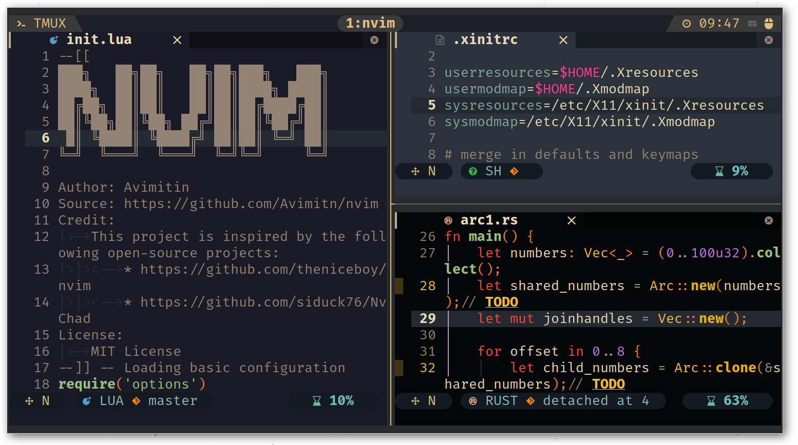

# neovim-deus

A fork from [theniceboy/nvim-deus](https://github.com/theniceboy/nvim-deus).
Original theme is from [vim-deus](https://github.com/ajmwagar/vim-deus).
This version fix the error that deus theme is still using the deprecated `t_Co`
option.

Template generated by [Iron-E/nvim-highlite](https://github.com/Iron-E/nvim-highlite)

## Modified

 

The original background color is still too light for me, so I add more
background color to fit my needs. Now you can change background color by global
variable `vim.g.deus_background`.

Available options:

```lua
-- Background color from tokyo-night, shown on the left.
vim.g.deus_background = "mid"
-- Black and high contrast, displayed on the right bottom.
vim.g.deus_background = "hard"
```

If you are not using Lua as configuration language, set the variable like below:

```vimscript
let g:deus_background = "mid"
```

## Requirement

You will need neovim at least v0.5+.

Also neovim support runtime Lua in [#14686](https://github.com/neovim/neovim/pull/14686).
This repository is now using `deus.lua` which is not supported in older version. You can
add a tag specification for vim-plug.

- For people using older version which not support runtime lua.

```vim
Plug 'Avimitin/neovim-deus', { 'tag': 'v0.1' }
```

- For people using version after `NVIM v0.5.0-*-g687eb0b39`

```vim
Plug 'Avimitin/neovim-deus'
```

## Terminal theme

Alacritty, Windows Terminal and simple terminal theme is supported. Copy the 
setting from `./terminals` and applied it to your terminal.

## Known issues

~~Theme doesn't take effect on the neovim with version: 
`NVIM v0.5.0-dev+1390-g988f88c24`~~

If your neovim have problems like the colorscheme looks like default, you 
can try to set termguicolors before setting the theme.

Example fix:

```vim
set termguicolors

let &t_8f = "\<Esc>[38;2;%lu;%lu;%lum"
let &t_8b = "\<Esc>[48;2;%lu;%lu;%lum"

set background=dark    " Setting dark mode
colorscheme deus
let g:deus_termcolors=256
```

Checks 
[Color doesn't changed after installed the plugin #11](https://github.com/Iron-E/nvim-highlite/issues/11)
for more details.
